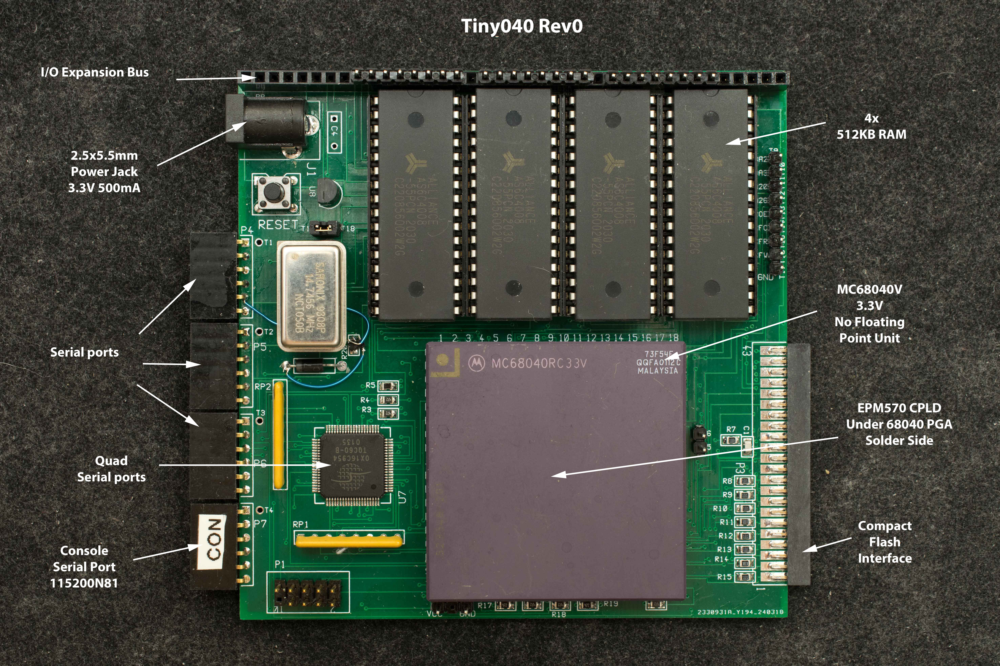
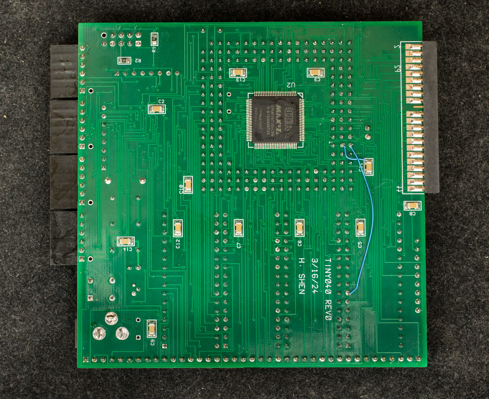

# Tiny040
Tiny040 is a 3.3V SBC based on MC68040V. It is a memmber of 100mmX100mm Tinyxxx exploratory designs

### Features

- 3.3V SBC
- MC68040RC33V CPU
- 4x512KB RAM for total of 2meg RAM
- EPM570 CPLD
- Bootstrap ROM in CPLD
- Compact flash interface
- Quad serial based on OX16C954
- 40-pin IO expansion bus
- 100x100mm 4-layer PC board

### Theory of Operation
The exploratory aspect of Tiny040 is how it bootstrap from CPLD. EPM570 CPLD has 1KB of internal flash that's organized as a 16-bit wide flash. 68040 requires 32-bit wide memory for program execution, so TIny040 explores a scheme to read the first 16-bit flash data into a holding register then read the 2nd 16-bit data and presents the 32-bit data as program for 68040 to execute. The bootstrap program can load & run applications from CF disk.

### Design Files
- Schematic
- Gerber photoplots
- CPLD design files

### Software
- Tiny040 monitor
